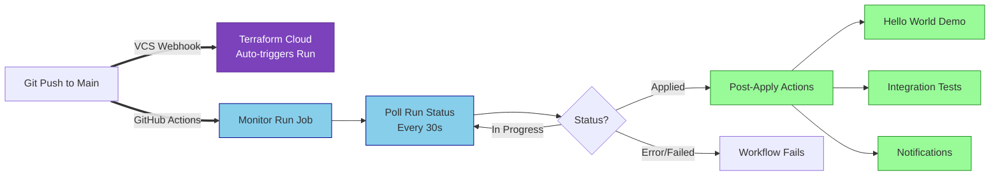

# VCS-Backed Workspace Monitoring Workflow

## Overview

This workflow demonstrates how to monitor Terraform Cloud runs for **VCS-backed workspaces** and perform post-apply CI/CD actions.

### Key Difference: VCS-Backed vs API-Driven

| Aspect | **VCS-Backed (This Repo)** | **API-Driven** (`it-ops-api-automation`) |
|--------|---------------------------|------------------------------------------|
| **Run Trigger** | Automatic via VCS webhook (git push) | Manual via GitHub Actions API call |
| **Workflow Mode** | 🔍 **Monitor** existing runs | 🚀 **Create** new runs |
| **Control** | TFC manages run lifecycle | GitHub Actions manages run lifecycle |
| **Use Case** | Standard Terraform workflow + CI/CD | Full API-driven automation with policies |

## Workflow: `monitor-terraform-run.yml`

### What It Does

1. **Finds Latest Run** - Queries TFC API for the most recent run in the workspace
2. **Monitors Progress** - Polls run status every 30 seconds until completion
3. **Post-Apply Actions** - Executes CI/CD steps after Terraform apply succeeds

### Triggers

- **Push to main** - Automatically monitors the run triggered by VCS webhook
- **Manual dispatch** - Optionally monitor a specific run by providing `run_id`

### Job Flow



## Jobs

### Job 1: `monitor-run`

**Purpose:** Find and monitor the Terraform run until completion

**Steps:**
1. **Find Latest Run** - Queries TFC workspace for most recent run
2. **Wait for Apply Completion** - Polls every 30 seconds (60 min timeout)
3. **Generate Summary** - Creates GitHub Actions summary with run details

**Outputs:**
- `run_id` - The TFC run ID being monitored
- `run_status` - Final status (applied, errored, etc.)
- `run_link` - Direct link to run in TFC UI

### Job 2: `post-apply-actions`

**Purpose:** Execute CI/CD processes after Terraform apply succeeds

**Runs When:** `run_status == 'applied' || 'planned_and_finished'`

**Example Steps:**
- 🎉 Hello World confirmation
- 🧪 Integration tests
- 📢 Notifications
- 📊 Summary generation

## Configuration

### Required Secrets

```yaml
TF_API_TOKEN          # Terraform Cloud API token (read access sufficient)
```

### Required Variables

```yaml
TF_CLOUD_ORGANIZATION # Your TFC organization name
TF_WORKSPACE          # The VCS-backed workspace name
```

## Use Cases

### 1. Standard VCS Workflow with CI/CD

```
Developer pushes code → TFC auto-plans/applies → GitHub monitors → Run tests/deploy apps
```

**Why?** You want standard Terraform workflow but need to orchestrate additional steps after apply.

### 2. Monitoring Production Deployments

```
Monitor critical workspace → Alert on failures → Run smoke tests → Update status page
```

**Why?** Track production deployments and ensure downstream systems are updated.

### 3. Multi-Stage Deployments

```
TFC applies infrastructure → GitHub deploys applications → Run health checks → Promote to next environment
```

**Why?** Coordinate infrastructure and application deployments in a single pipeline.

## Workflow Customization

### Add Real Integration Tests

Replace the placeholder in `post-apply-actions`:

```yaml
- name: Run Integration Tests
  run: |
    # Example: Test newly deployed resources
    ./scripts/test-infrastructure.sh

    # Example: Test application endpoints
    curl -f https://newly-deployed-app.example.com/health
```

### Add Notifications

```yaml
- name: Notify Slack
  uses: slackapi/slack-github-action@v1
  with:
    webhook-url: ${{ secrets.SLACK_WEBHOOK }}
    payload: |
      {
        "text": "Terraform apply completed: ${{ needs.monitor-run.outputs.run_link }}"
      }
```

### Add Application Deployment

```yaml
- name: Deploy Application
  run: |
    # Get outputs from Terraform
    kubectl apply -f k8s-manifests/

    # Deploy to newly provisioned infrastructure
    ./deploy.sh --environment production
```

## Comparison with API-Driven Workflow

### When to Use VCS-Backed (This Repo)

✅ You want Terraform Cloud to manage the plan/apply workflow
✅ You prefer git-based workflow (push = deploy)
✅ You need post-apply CI/CD orchestration
✅ You want to monitor and react to TFC runs

### When to Use API-Driven (`it-ops-api-automation`)

✅ You need full control over when runs are created
✅ You want policy override workflows with separation of duties
✅ You need to orchestrate complex approval processes
✅ You want GitHub Actions to drive the entire lifecycle

## Monitoring vs Creating Runs

| Feature | **VCS-Backed (Monitor)** | **API-Driven (Create)** |
|---------|--------------------------|-------------------------|
| Who creates run? | TFC (VCS webhook) | GitHub Actions (API) |
| When does run start? | On git push | On workflow trigger |
| Policy handling | In TFC UI | In GitHub Actions workflows |
| Override workflow | Manual in TFC | Automated via `2a-policy-override` |
| Post-apply actions | ✅ Supported | ✅ Supported |
| Separation of duties | In TFC permissions | In GitHub Actions workflows |

## Troubleshooting

### "No run found for workspace"

**Cause:** Workspace has no runs or workspace name is incorrect

**Solution:**
- Verify `TF_WORKSPACE` variable matches your TFC workspace
- Ensure at least one run exists in the workspace
- Check VCS connection is configured

### "Most recent run is already in terminal state"

**Cause:** Workflow ran after the TFC run already completed

**Solution:**
- This is normal if GitHub Actions triggers after TFC finishes
- The workflow will still report the status
- Consider adjusting git push timing or workflow triggers

### "Timeout waiting for run to complete"

**Cause:** Run took longer than 60 minutes

**Solution:**
- Increase `timeout-minutes` in the `wait-apply` step
- Check if run is stuck in TFC (policy failures, manual confirmation)
- Verify run is actually progressing in TFC UI

## Example Workflow Run

```
🔍 Finding latest run for VCS-backed workspace...
Workspace ID: ws-abc123xyz
📋 Latest Run Details:
   Run ID: run-xyz789abc
   Status: planning
   Message: Triggered via git push

⏳ Monitoring run until apply completes...
🔗 View run: https://app.terraform.io/app/my-org/workspaces/my-workspace/runs/run-xyz789abc

[10:30:15] Current status: planning
[10:30:45] Current status: planned
[10:31:15] Current status: confirmed
[10:31:45] Current status: applying
[10:32:15] Current status: applying
[10:32:45] Current status: applied

✅ Apply completed successfully!

🎉 Hello World! Terraform apply has completed successfully.
🧪 Running integration tests...
✅ Integration tests passed!
📢 Sending success notification...
✅ Notification sent!
```

## Related Documentation

- [List Runs in a Workspace API](https://developer.hashicorp.com/terraform/enterprise/api-docs/run#list-runs-in-a-workspace)
- [Run States Documentation](https://developer.hashicorp.com/terraform/cloud-docs/run/states)
- [VCS-Driven Workflow](https://developer.hashicorp.com/terraform/cloud-docs/run/ui)
