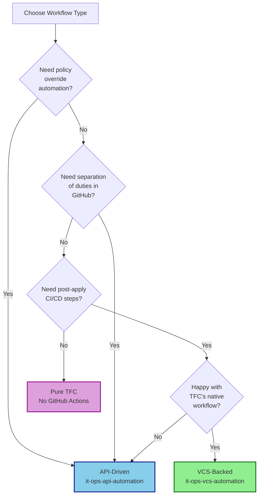

# VCS-Backed vs API-Driven Workflows

## Side-by-Side Comparison

### VCS-Backed Workflow (This Repo)

```mermaid
graph LR
    Dev[👨‍💻 Developer] -->|Git Push| GitHub[GitHub Repo]
    GitHub ==>|VCS Webhook| TFC[☁️ Terraform Cloud]
    TFC -->|Auto Plan| Plan[📋 Plan]
    Plan -->|Auto Apply| Apply[🚀 Apply]
    GitHub -->|Monitors| Monitor[🔍 GitHub Actions<br/>Monitor Workflow]
    Apply -.->|Detects completion| Monitor
    Monitor --> PostApply[✅ Post-Apply<br/>CI/CD Steps]

    classDef actor fill:#FFB6C1,stroke:#8B008B,stroke-width:2px
    classDef tfc fill:#7B42BC,stroke:#5C2D91,stroke-width:2px,color:#fff
    classDef monitor fill:#90EE90,stroke:#006400,stroke-width:2px
    classDef success fill:#98FB98,stroke:#228B22,stroke-width:2px

    class Dev actor
    class TFC,Plan,Apply tfc
    class Monitor monitor
    class PostApply success
```

**Characteristics:**
- 🔵 **TFC manages** plan and apply
- 🟢 **GitHub monitors** and reacts
- ⚡ **Fast** - leverages TFC's VCS integration
- 📝 **Git-centric** - push = deploy

---

### API-Driven Workflow (`it-ops-api-automation`)

```mermaid
graph LR
    Dev[👨‍💻 Developer] -->|Triggers| GHA1[📋 GitHub Actions<br/>Plan Workflow]
    GHA1 -->|API Call| TFC1[☁️ TFC: Create Run]
    TFC1 -->|Returns run_id| GHA2[🛡️ GitHub Actions<br/>Policy Check]
    GHA2 -->|If fail| Approver[👮 Security<br/>Approver]
    Approver -->|Override| GHA3[🔓 GitHub Actions<br/>Override Workflow]
    GHA2 -->|If pass| GHA4[🚀 GitHub Actions<br/>Apply Workflow]
    GHA3 --> GHA4
    GHA4 -->|API Call| TFC2[☁️ TFC: Apply Run]

    classDef actor fill:#FFB6C1,stroke:#8B008B,stroke-width:2px
    classDef tfc fill:#7B42BC,stroke:#5C2D91,stroke-width:2px,color:#fff
    classDef workflow fill:#87CEEB,stroke:#00008B,stroke-width:2px

    class Dev,Approver actor
    class TFC1,TFC2 tfc
    class GHA1,GHA2,GHA3,GHA4 workflow
```

**Characteristics:**
- 🔵 **GitHub manages** entire lifecycle
- 🟣 **Policy governance** in GitHub workflows
- 🔐 **Separation of duties** with override workflow
- 🎯 **Full control** over timing and approvals

---

## When to Use Each Approach

### Use VCS-Backed (This Repo) When:

✅ **Standard Terraform workflow is sufficient**
- You're comfortable with TFC's built-in plan/apply flow
- Git push should trigger deployment automatically
- Policy management happens in TFC UI

✅ **You need post-deployment orchestration**
- Run tests after infrastructure is deployed
- Deploy applications to new infrastructure
- Send notifications or update external systems

✅ **Simplicity is preferred**
- One workflow, simpler to maintain
- Leverage TFC's native VCS integration
- Don't need complex approval workflows

**Example Use Case:**
*"We use TFC's standard workflow, but need to run integration tests and deploy our app after infrastructure changes are applied."*

---

### Use API-Driven (`it-ops-api-automation`) When:

✅ **You need full lifecycle control**
- Control exactly when runs are created
- Coordinate with other systems before plan/apply
- Implement custom timing or scheduling

✅ **Complex policy governance required**
- Automated policy override workflows
- Separation of duties (different users for override)
- Audit trails for compliance
- Custom approval processes

✅ **GitHub Actions is your orchestration hub**
- All infrastructure workflows in one place
- Consistent patterns across teams
- Advanced error handling and retry logic

**Example Use Case:**
*"We need separation of duties where security approvers can override policy failures with justification, and all approvals must happen through GitHub Actions workflows."*

---

## Technical Differences

| Aspect | VCS-Backed | API-Driven |
|--------|-----------|-----------|
| **Run Creation** | TFC (VCS webhook) | GitHub Actions (API) |
| **Trigger** | Git push | Workflow dispatch |
| **Policy Override** | TFC UI | GitHub Actions workflow |
| **Approvals** | TFC native | GitHub Actions custom |
| **Complexity** | Low (1 workflow) | Medium (4 workflows) |
| **Flexibility** | Limited | High |
| **Best For** | Standard workflows + CI/CD | Complex governance + automation |

---

## Can You Use Both?

**Yes!** You can have:
- VCS-backed workspaces for most teams (simple)
- API-driven workspaces for production (governance)

Different workspaces can use different approaches based on requirements.

---

## Architecture Decision

---

## Summary

**VCS-Backed Monitoring:**
- 🎯 Simple, git-centric workflow
- 🔍 Monitor TFC runs and react to completion
- ✅ Perfect for post-deployment orchestration

**API-Driven Control:**
- 🎯 Full control over Terraform lifecycle
- 🔐 Complex policy governance with separation of duties
- ✅ Perfect for enterprise compliance requirements

Choose based on your governance needs and team workflow preferences!
